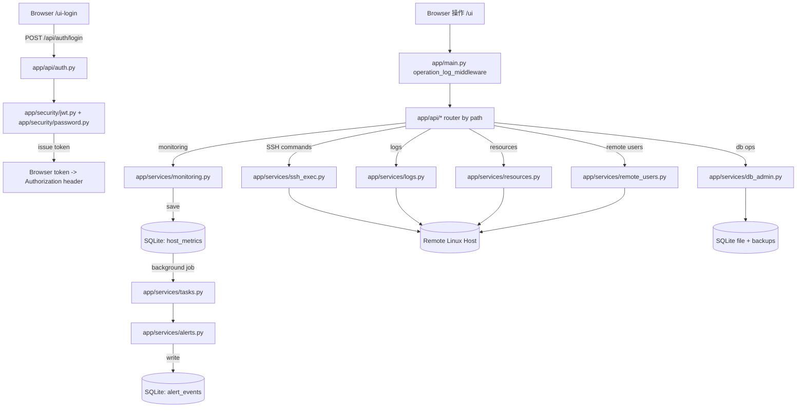

# Octopus Ops MVP（v1.0）代码阅读指南

> 目标：让“零基础读者”也能按顺序读懂项目在做什么、每个功能链路如何从前端发起、后端如何路由与鉴权、最终如何落到数据库与 SSH 执行。
>
> 说明：本文件先提供“项目总览 + 阅读路线图 + 关键模块关系 + 简历可写亮点”。更细的“逐行注释版”我会按方案A拆分到后续的分文件中（例如 `docs/api_auth.md`、`docs/services_ssh_exec.md` 等），避免一次性改动/输出过大。

---

## 1. 项目一句话总览（严格基于代码）

该项目是一个基于 **FastAPI + SQLAlchemy(Async) + SQLite + JWT** 的轻量运维平台。

核心能力链路如下：

1. 浏览器打开前端页面：
   - 登录页：`/ui-login`（返回 `app/ui/login.html`）
   - 控制台页：`/ui`（返回 `app/ui/index.html`）
2. 前端登录成功后，将 `access_token`/`refresh_token` 存入 `localStorage`，并在后续请求里带 `Authorization: Bearer ...`。
3. 后端通过 `OAuth2PasswordBearer` 指向的登录地址完成 token 获取，通过 `get_current_user` 将 token 解析成 `User` 对象。
4. 各类业务由 `app/api/*` 的 router 处理，请求进一步进入 `app/services/*`：
   - 监控：写入 `host_metrics`
   - 告警：评估阈值/触发器写入 `alert_events`
   - SSH 运维：通过 `app/services/ssh_exec.py` 统一执行远端命令
   - 日志采集：通过 `app/services/logs.py`（SSH 执行 ls/tail）
   - 操作记录：通过 `app/core/oplog.py` 写入 `operation_logs`
5. 项目启动时执行极简迁移（补列/建表）与默认管理员 bootstrap，并启动一个定时采集调度器（`MetricsScheduler`）。

---

## 2. 运行入口在哪里（你应该先读哪个文件）

你要从最“总控”的入口开始，而不是从某个功能点下手。

### 2.1 第一步：`app/main.py`
你需要重点读这几块：

1. `lifespan(app)`：启动时做了哪些事
   - `run_sqlite_migrations(engine)`
   - `Base.metadata.create_all`
   - `ensure_bootstrap_admin(db)`
   - `metrics_scheduler.start()`
2. `operation_log_middleware(request, call_next)`
   - 尝试读取 `Authorization` token 并写入 `operation_logs`
3. `app.include_router(...)`
   - 注册所有 API：`app/api/*`
4. 前端路由：
   - `/ui` → `FileResponse("app/ui/index.html")`
   - `/ui-login` → `FileResponse("app/ui/login.html")`

读完 `app/main.py` 后，你基本能回答：
“系统启动时做了什么”“有哪些 API”“前端从哪里来”。

---

## 3. 逻辑图：从请求到落库/SSH（建议收藏）

---

## 4. 数据隔离与安全：代码如何保证“用户只看自己主机”

平台的隔离逻辑来自后端代码（不是前端）。

### 4.1 数据结构
- `app/db/models.py`
  - `Host.owner_id`：记录该主机由哪个平台用户创建/拥有

### 4.2 权限校验点（你应该读这些 API）
- `app/api/hosts.py`
  - `get_hosts`：普通用户只返回 `Host.owner_id == user.id`
  - `add_host`：新增时写入 `owner_id=user.id`
  - `delete/toggle/update_host`：普通用户只能操作自己拥有的 host
- 其它依赖 host 的 API 同样做校验：
  - `app/api/resources.py`
  - `app/api/remote_users.py`
  - `app/api/security.py`（登录历史）
  - `app/api/logs.py`（日志源、列文件、tail）

你读每个 API 时，可以快速定位一个公共模式：
“先通过 `_get_host(..., user)` 拿到 host；非管理员且不属于 owner_id 则 `403`”。

---

## 5. 前端如何调用后端（你应该读哪些前端文件）

前端只有两个入口 HTML：

- `app/ui/login.html`
  - `doLogin()`：调用 `POST /api/auth/login`（form-urlencoded）
  - 保存 token 到 `localStorage("octopus_tokens_v1")`
  - 保存用户名到 `localStorage("octopus_username_v1")`
  - 成功后跳转到 `/ui`
- `app/ui/index.html`
  - 页面初始化时加载 token
  - 没 token → 跳转 `/ui-login`
  - 有 token → 拉取主机列表、初始化各功能区
  - “右上角用户信息下拉”触发 logout 与页面切换

阅读前端时建议用方法：
1. 在 `index.html` 里搜索某个接口路径，例如 `/api/hosts`
2. 追踪调用的函数名
3. 在后端对应 router 文件里找到同样的路径与函数
4. 再追到服务层与数据库写入点

---

## 6. 简历亮点（你可以直接照写，但要与代码对齐）

你可以把亮点写成“从需求到实现路径”的句子（避免空泛）。

建议亮点（每条都能在代码里找到对应证据）：

1. 会话管理：基于 JWT access/refresh + token denylist，实现登录态作废（`app/api/auth.py`、`app/core/deps.py`、`app/db/models.py`）。
2. 运维执行：对 SSH 子进程封装统一执行入口（`app/services/ssh_exec.py`），在 Windows 事件循环下通过线程执行阻塞 subprocess 提升兼容性。
3. 监控与告警链路：监控采集写入 `host_metrics`，再异步触发告警评估写入 `alert_events`，支持手动触发器与邮件通知（`services/monitoring.py`、`services/tasks.py`、`services/alerts.py`、`services/email_notify.py`）。
4. 数据隔离：主机通过 `Host.owner_id` 关联创建用户，相关 API 统一校验权限，确保普通用户只能访问自己添加的主机相关数据。
5. 操作可追溯：通过 `operation_log_middleware` 写入 `operation_logs`，覆盖主要接口请求（`app/main.py`、`app/core/oplog.py`）。

---

## 7. 从哪里开始读（推荐阅读顺序，适合小白）

按这个顺序读，读完每一步你都能理解“下一步为何存在、数据流为何连续”。

1. `app/main.py`
2. `app/core/config.py`
3. `app/core/deps.py`
4. `app/security/jwt.py` 与 `app/security/password.py`
5. `app/api/auth.py`
6. `app/api/hosts.py`（数据隔离关键）
7. `app/api/monitoring.py` 与 `app/services/monitoring.py`
8. `app/services/tasks.py` 与 `app/services/alerts.py`
9. `app/services/ssh_exec.py`
10. `app/api/resources.py` 与 `app/services/resources.py`
11. `app/api/remote_users.py` 与 `app/services/remote_users.py`
12. `app/api/logs.py` 与 `app/services/logs.py`
13. `app/api/db.py` 与 `app/services/db_admin.py`
14. 最后回到前端：`app/ui/login.html` → `app/ui/index.html`

---

## 8. 实现讲解文档（恢复后入口）

> 原清单中的 61 个拆分文件在当前仓库中已丢失。  
> 已恢复为一个可直接使用的总册，按原编号保留模块映射与阅读重点。

- 总册：`docs/implementation_modules_compendium.md`
- 用法：先在总册里按编号定位模块，再回到对应代码文件逐段阅读。
- 如果需要重新拆分 61 个独立文档，可按总册逐条扩展。

---

## 9. 下一步怎么扩展成“逐行注释文档”（方案A落地方式）

本文件不做逐行注释（避免输出过长），而是让你先把“系统结构”看懂。

接下来我会按模块拆分分文件，每个分文件遵循：
1. 先用“入口函数 → 调用服务 → 读写表 → 输出响应”的结构解释一遍；
2. 再对关键函数代码块进行逐行解释（不改代码，只解释）；
3. 最后总结该模块的“简历可用亮点句子”。

你可以告诉我你最想优先写成分文件的模块（例如：JWT 登录 / SSH 执行 / 监控告警链路 / 数据隔离 / 日志采集 / 备份恢复），我会从你选的模块开始做。

